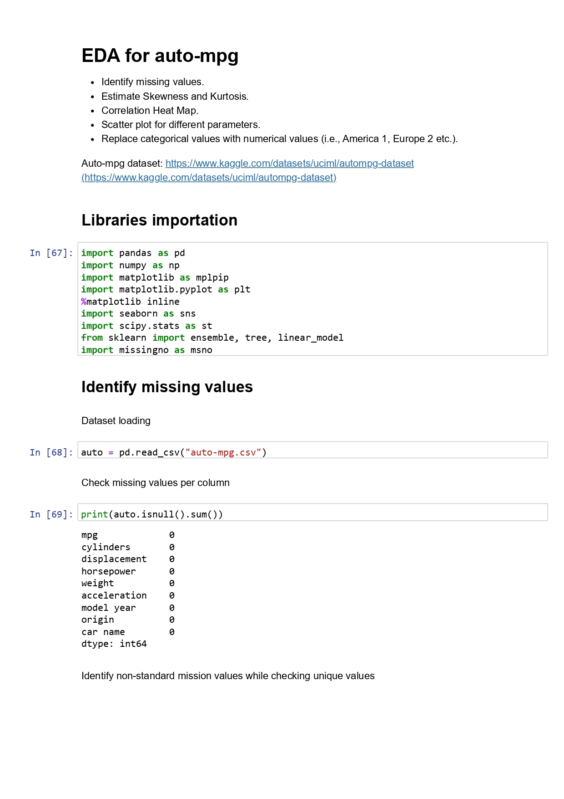
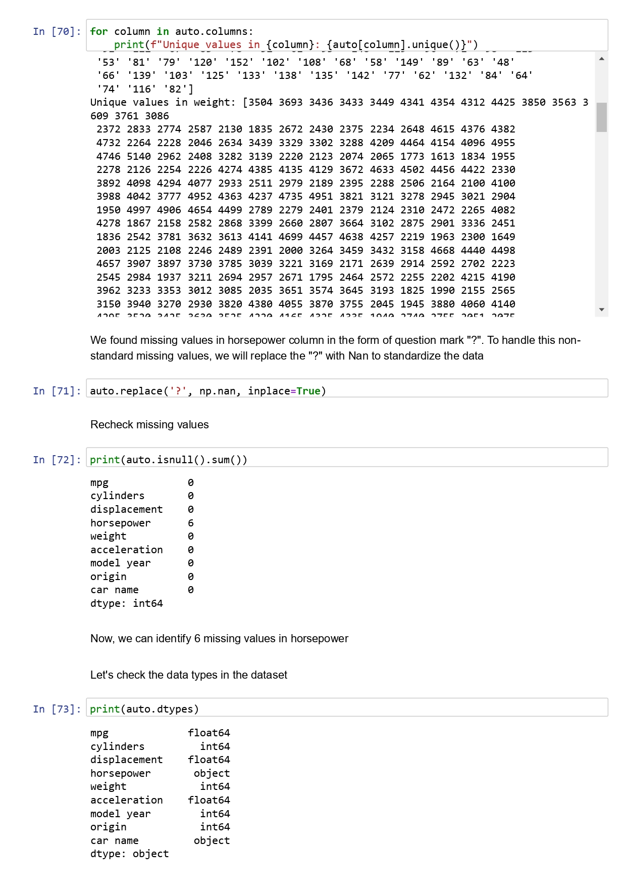
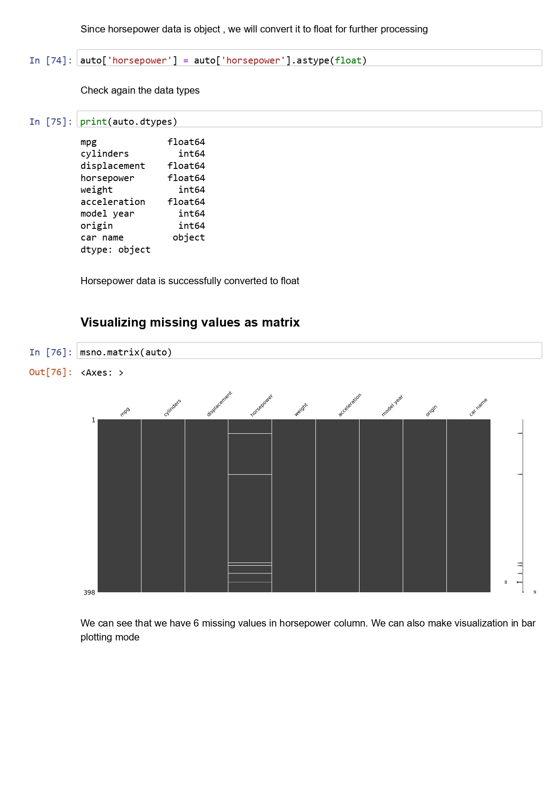
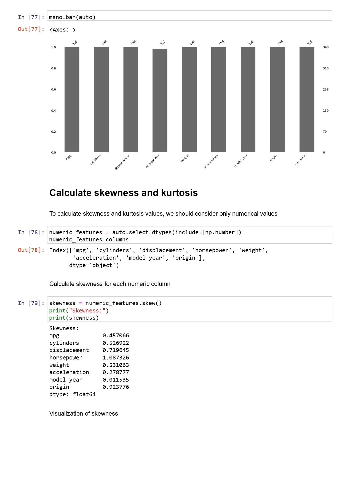
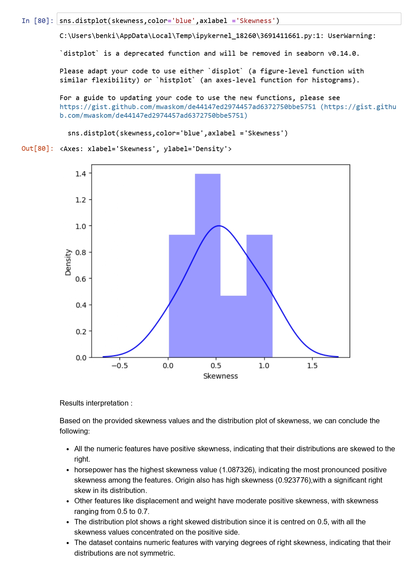
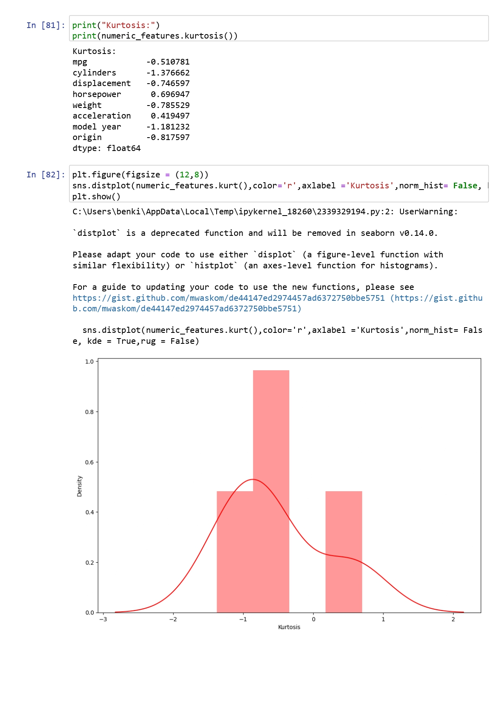
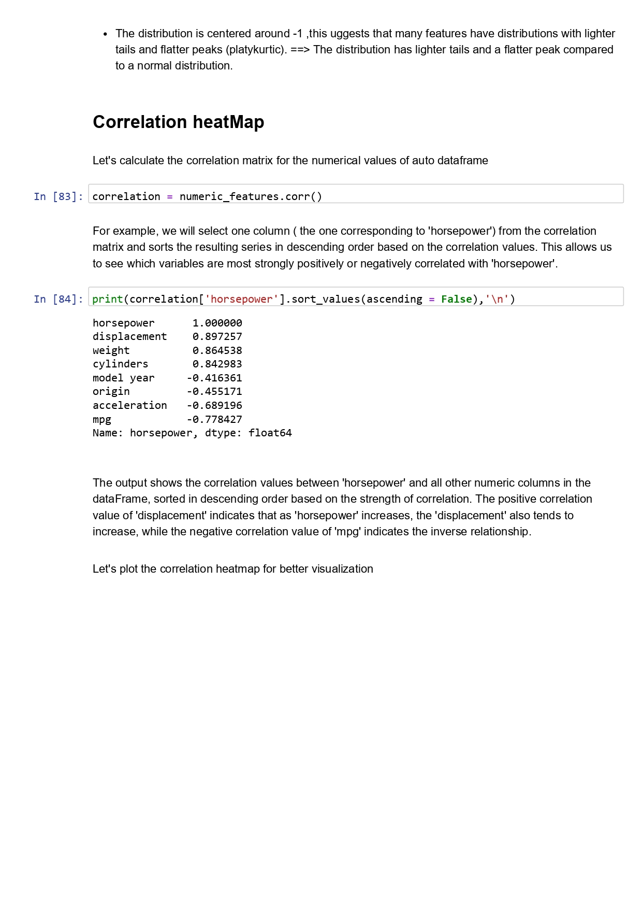
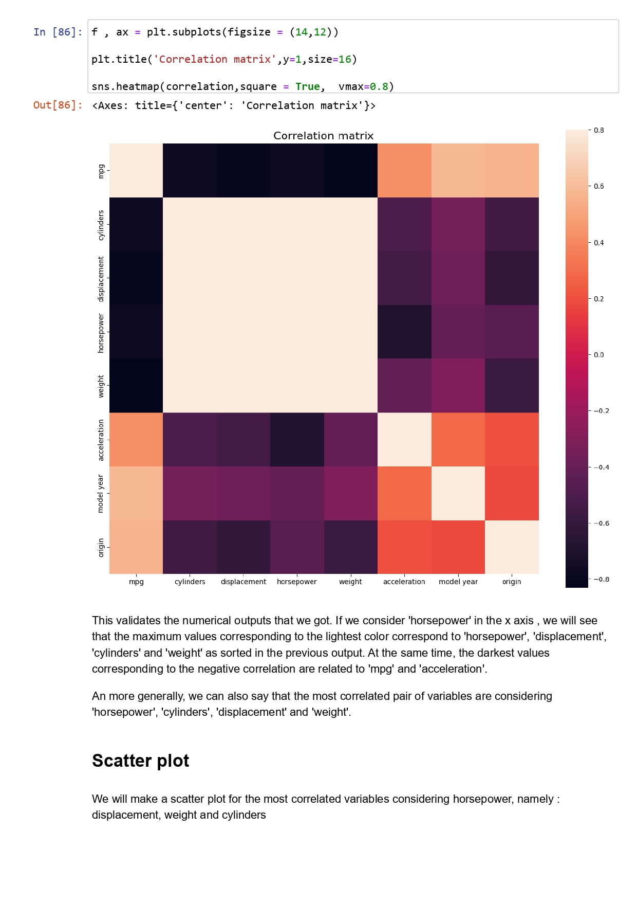
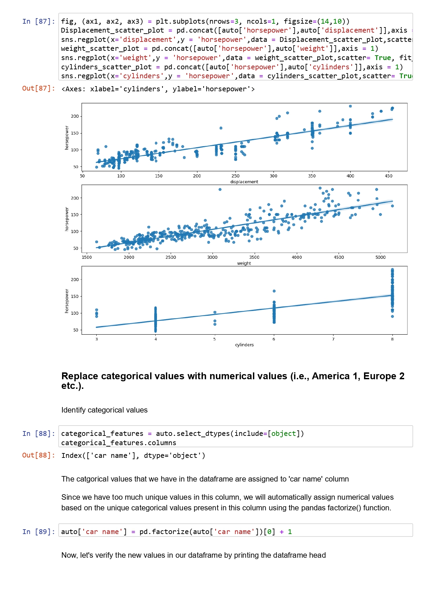

# Exploratory Data Analysis

Exploratory Data Analysis (EDA): an approach for summarizing, visualizing, and becoming intimately familiar with the important characteristics of a data set.

## EDA methods:
+ Univariate visualization: summary statistics for each field
+ Bivariate visualization:  relationship between each variable
+ Multivariate visualization:  interactions between different fields
+ Dimensionality reduction : the fields in the data that account for the most variance between observations

**A Tutorial on Exploratory Data Analysis** [Click to download the ipynb file](./Supplementary_Material/Unit02_A_Tutorial_on_Exploratory_Data_Analysis.ipynb)

**Seminar: EDA with Auto-mpg dataset** [Click to download the ipynb file](./Supplementary_Material/EDA_With_Auto_Mpg_Dataset.ipynb)

