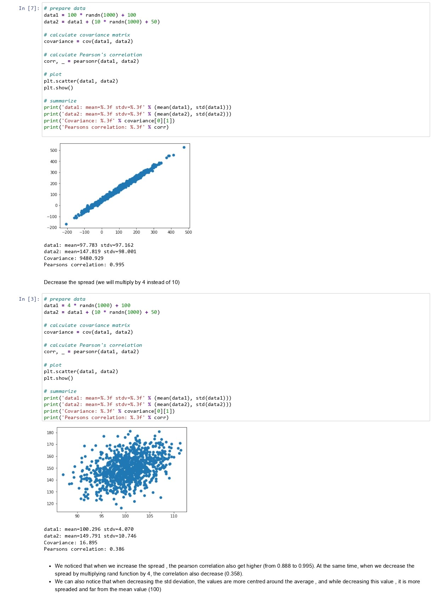
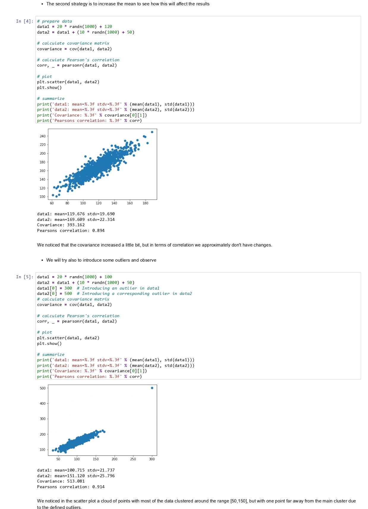
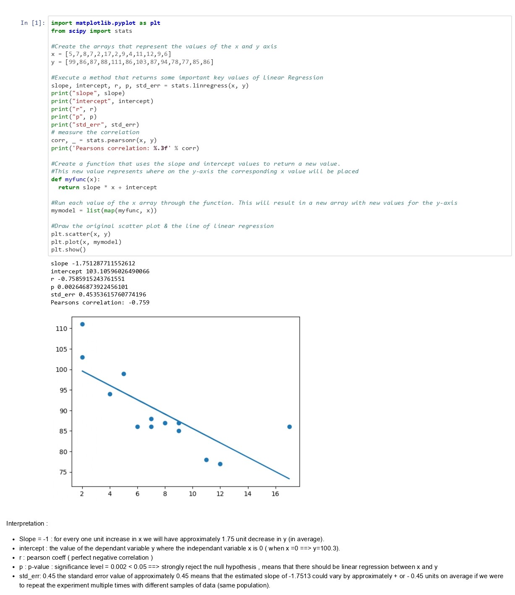

# Correlation and Regression

## Correlation 
**Ex1 covariance pearson correlation** [Click to download the ipynb file](./Supplementary_Material/Unit03_Ex1_covariance_pearson_correlation.ipynb)

Correlation aims to find the degree of relationship between two variables.

A scatter plot is the best method to visually represent the relationship between two variables.

Correlation does not mean causation, although they might exist at the same time.

## Covariance
Covariance is  indicates the relationship of two variables. 

Size of covariance: Large number means strong correlation.

Limitation: The covariance is dependent on the variability in the data. So a large variance gives large numbers. Therefore, the magnitude cannot be measured, that is why it is difficult to interpret.

Limitations of Pearson's r: It is sensitive to outliers. It can only be used to predict linear relationship.

## Regression
Regression analysis is a set of statistical methods used to estimate relationships between a dependent variable and one or more independent variables.

## Linear Regression 
**Ex2 linear regression** [Click to download the ipynb file](./Supplementary_Material/Unit03_Ex2_linear_regression.ipynb)
+ Linear relationship
+ Observations are independent
+ Residuals (difference between predicted and observed values of dependent variables) are normally distributed
+ Residuals have the same variance

## Multiple Linear Regression
**Ex3 multiple linear regression** [Click to download the ipynb file](./Supplementary_Material/Unit03_Ex3_multiple_linear_regression.ipynb)

It is used to predict a correlation between more than one independent variables and a dependent variable.

## Classification – Logistic Regression
Regression can also be used for classification. 

Logistic regression, binary classification, can predict a binary outcome (yes/no). For definitive multi-class classification, we use decision tree type classifying algorithms

## Polynomial Regression
**Ex4 polynomial linear regression** [Click to download the ipynb file](./Supplementary_Material/Unit03_Ex4_polynomial_regression.ipynb)

Polynomial regression is a form of regression analysis in which the relationship between the independent variable x and the dependent variable y is modeled as an nth degree polynomial in x.

