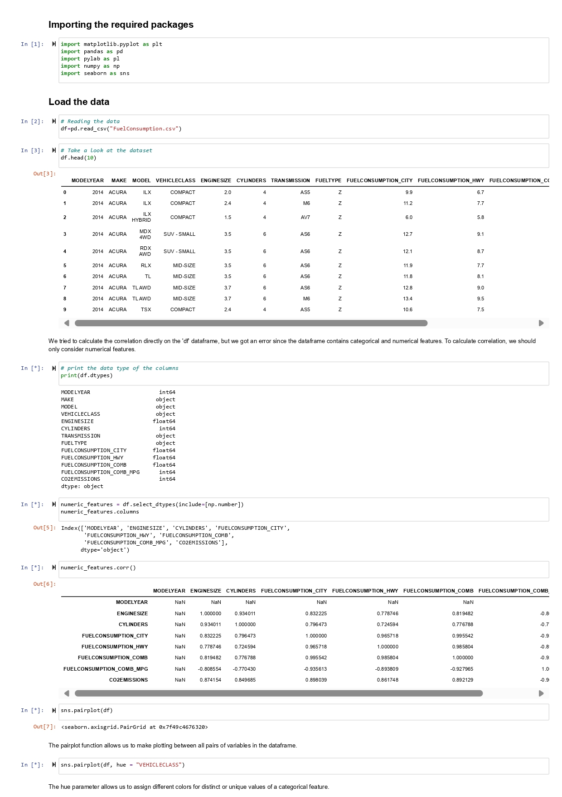
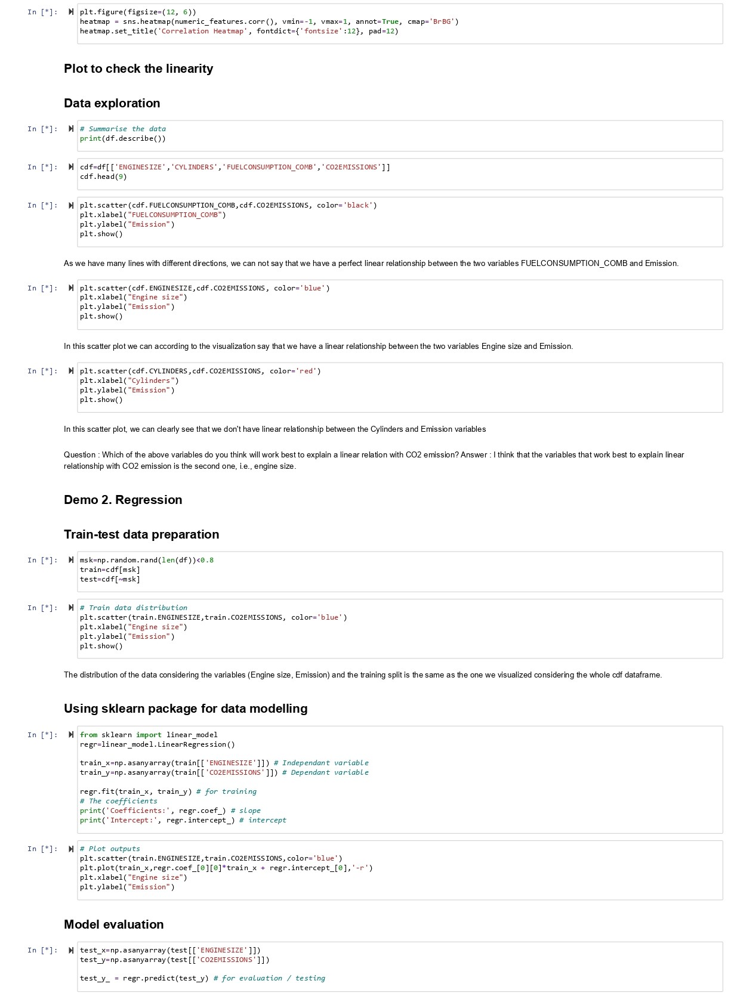
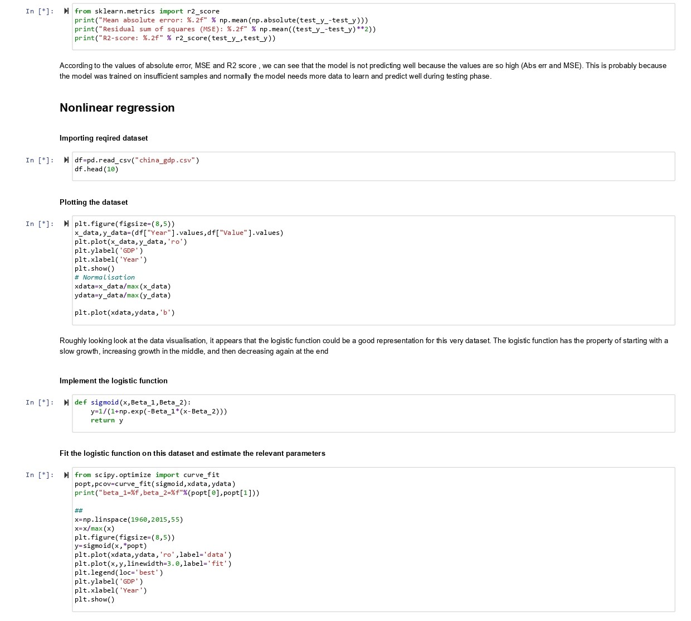

# Linear Regression with Scikit-Learn
## Example: Regression- Fuel Comsumption
**Demo correlation regression** [Click to download the ipynb file](.Supplementary_Material/Unit04-Notebook_Lecturer_Final.ipynb)

## Correlation and Regression - Global Population & per capita GDP
**Tasks A & B** [Click to download the ipynb file](.Supplementary_Material/Unit04-Task_Final.ipynb)

