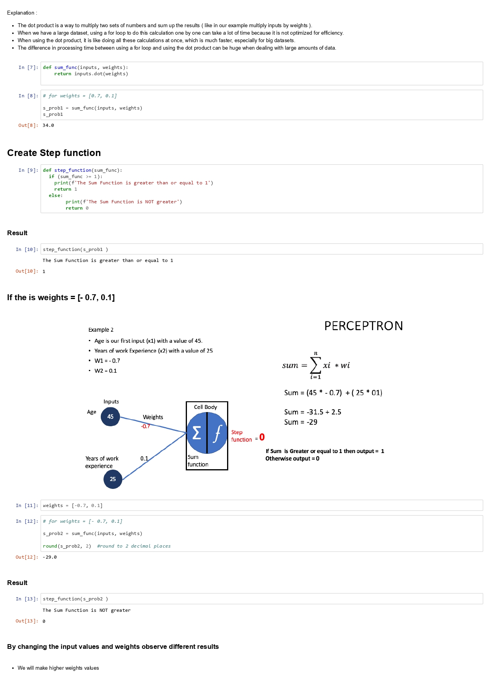
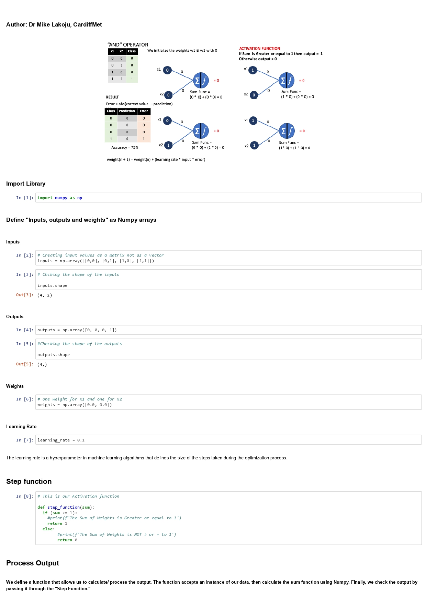

# Introduction to Artificial Neural Networks (ANNs)
+ Ex1 Simple perceptron 
+ Ex2 Perceptron "And" Operator 
+ Ex3 Multilayer Perceptron

## Ex1 Simple perceptron 
[Click to download the ipynb file](./Supplementary_Material/Unit07_Ex1_simple_perceptron.ipynb)

## Ex2 Perceptron "And" Operator 
[Click to download the ipynb file](./Supplementary_Material/Unit07_Ex2_perceptron_AND_operator.ipynb)

## Ex3 Multilayer Perceptron
[Click to download the ipynb file](./Supplementary_Material/Unit07_Ex3_multi_layer_Perceptron.ipynb)

